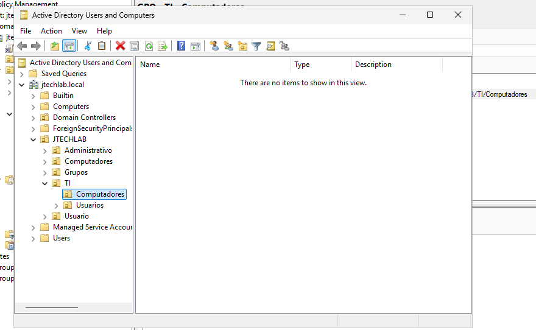

# Active Directory

## Objetivo

Configurar o Active Directory Domain Services (AD DS)
para centralizar a autenticação e o gerenciamento dos
recursos do laboratório.

## Ambiente

- Servidor: SRVWIN
- Domínio: jtechlab.local
- IP: 192.168.10.10
- Sistema: Windows Server 2025

## Atividades realizadas

- Instalação da função AD DS
- Criação do domínio jtechlab.local
- Promoção do servidor a Controlador de Domínio
- Validação do domínio
- Abertura do Active Directory Users and Computers

## Resultado

O domínio `jtechlab.local` foi criado com sucesso e o
servidor SRVWIN passou a atuar como Controlador de Domínio.

## Evidências

