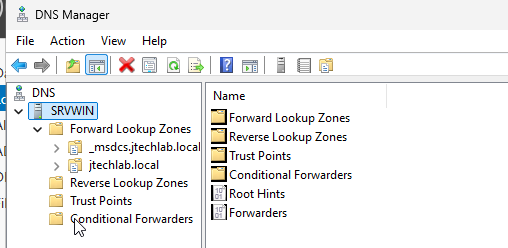
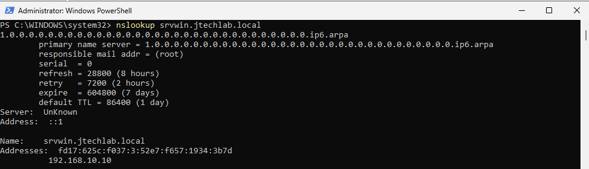

# DNS

## Objetivo

Configurar e validar o serviço DNS responsável pela resolução de nomes do domínio `jtechlab.local`.

O DNS é um componente fundamental do Active Directory, pois permite que computadores e serviços do domínio sejam localizados por meio de seus nomes.

## Ambiente

- **Servidor DNS:** SRVWIN
- **Endereço IP:** 192.168.10.10
- **Domínio:** jtechlab.local
- **Sistema:** Windows Server 2025
- **Virtualização:** VirtualBox

## O que é o DNS?

O Domain Name System (DNS) é responsável por traduzir nomes de computadores e serviços em endereços IP.

Por exemplo:

```text
srvwin.jtechlab.local
        ↓
192.168.10.10
```

Em um ambiente Windows com Active Directory, o DNS possui um papel essencial porque os computadores utilizam registros DNS para localizar o Controlador de Domínio e outros serviços da rede.

No laboratório, o DNS foi configurado no próprio servidor `SRVWIN`, que também atua como Controlador de Domínio.

## Atividades realizadas

- Instalação e configuração do serviço DNS
- Criação e validação da zona `jtechlab.local`
- Verificação dos registros DNS
- Verificação das zonas relacionadas ao Active Directory
- Testes de resolução de nomes utilizando `nslookup`
- Validação da resolução do servidor `SRVWIN`

## Configuração

O serviço DNS foi configurado no servidor `SRVWIN`, utilizando o endereço IP:

`192.168.10.10`

A zona principal do domínio utilizada no laboratório é:

`jtechlab.local`

Durante a configuração também foi possível identificar a zona `_msdcs.jtechlab.local`, utilizada pelo Active Directory para registros relacionados à localização de serviços do domínio.

## DNS e Active Directory

O Active Directory depende do DNS para localizar serviços e computadores dentro do domínio.

Por exemplo, quando um computador precisa localizar um Controlador de Domínio, registros DNS específicos podem ser consultados para descobrir onde estão os serviços necessários.

Por esse motivo, uma configuração correta do DNS é essencial para:

- Autenticação no domínio
- Localização do Controlador de Domínio
- Funcionamento do Active Directory
- Entrada de computadores no domínio
- Aplicação de Group Policies (GPOs)

## Validação

### DNS Manager

O **DNS Manager** foi utilizado para verificar a configuração das zonas DNS existentes no servidor.

Foram identificadas as seguintes estruturas:

- Forward Lookup Zones
- Reverse Lookup Zones
- `_msdcs.jtechlab.local`
- `jtechlab.local`

A zona `jtechlab.local` contém os registros utilizados para a resolução dos nomes do domínio.

## Teste de resolução de nomes

Foi utilizado o comando:

```cmd
nslookup srvwin.jtechlab.local
```

O comando `nslookup` é utilizado para consultar servidores DNS e verificar como um determinado nome é resolvido.

No laboratório, o objetivo do teste foi verificar se o nome completo do servidor `SRVWIN` poderia ser resolvido para o endereço IP correto.

Resultado esperado:

```text
192.168.10.10
```

A resolução correta do nome `srvwin.jtechlab.local` para `192.168.10.10` confirma que o registro DNS do servidor está sendo localizado corretamente.

## Validação adicional

Também foi realizada uma consulta aos registros de serviço do Active Directory:

```cmd
nslookup -type=SRV _ldap._tcp.dc._msdcs.jtechlab.local 192.168.10.10
```

Esse comando consulta registros do tipo **SRV**, utilizados para localizar serviços de rede.

No contexto do Active Directory, o registro consultado permite verificar a localização do serviço LDAP associado aos Controladores de Domínio.

A consulta foi utilizada para validar a publicação dos serviços do domínio no DNS.

## Resultado

O serviço DNS foi configurado com sucesso no servidor `SRVWIN`.

A zona `jtechlab.local` foi criada e validada, permitindo a resolução dos nomes utilizados pelo ambiente de laboratório.

A resolução de `srvwin.jtechlab.local` para `192.168.10.10` confirmou o funcionamento básico do DNS.

## Conceitos aprendidos

- O DNS traduz nomes em endereços IP.
- O Active Directory depende do DNS para localizar serviços do domínio.
- Zonas DNS armazenam informações utilizadas na resolução de nomes.
- Registros A relacionam nomes de hosts a endereços IPv4.
- Registros SRV permitem localizar serviços específicos.
- A zona `_msdcs` possui registros importantes para o funcionamento do Active Directory.
- O `nslookup` permite testar e diagnosticar a resolução DNS.
- Problemas de DNS podem afetar autenticação, ingresso no domínio e aplicação de GPOs.

## Evidências

### DNS Manager

A imagem abaixo demonstra o serviço DNS configurado no servidor `SRVWIN`, incluindo as zonas relacionadas ao domínio.



### Teste de resolução DNS

A imagem abaixo demonstra o teste de resolução do servidor utilizando `nslookup`.


